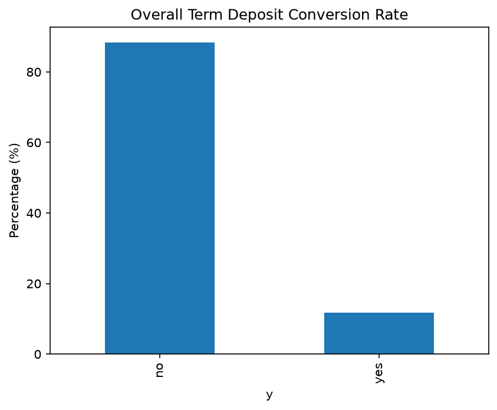
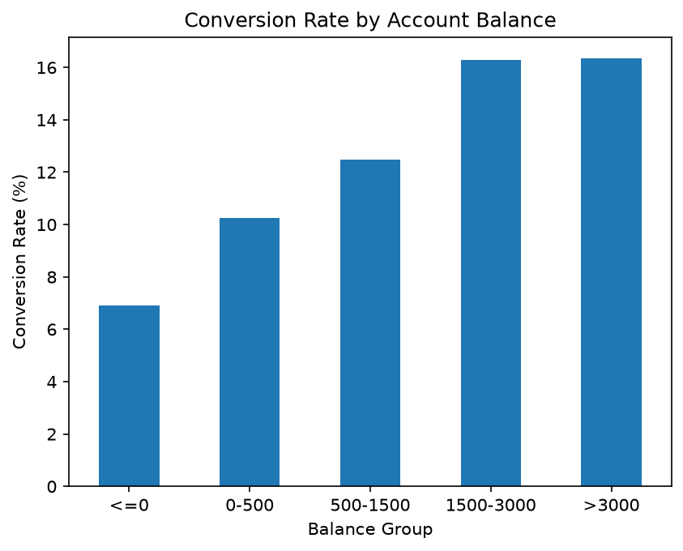
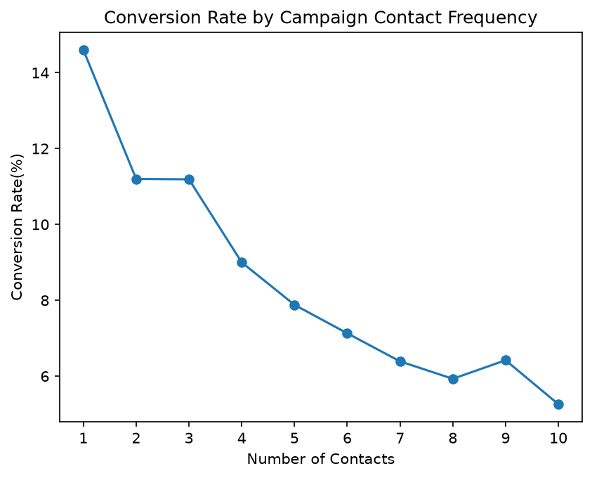

# Bank Customer CRM Analytics

## Project Overview

This project analyzes bank marketing campaign data to identify customer characteristics associated with term deposit conversion.

The analysis uses Python and SQL to explore customer demographics, financial characteristics, previous campaign interactions, and conversion behavior. The final goal is to identify high-potential customer segments that can help improve marketing targeting efficiency.

## Business Questions

This project aims to answer the following questions:

1. What is the overall term deposit conversion rate?
2. Which customer segments have higher conversion rates?
3. How do financial characteristics such as housing loans, personal loans, and account balance relate to conversion?
4. How do current and previous marketing interactions relate to conversion?
5. Which customers should be prioritized in future marketing campaigns?

## Tools

- Python
- Pandas
- Matplotlib
- SQL
- SQLite
- Jupyter Notebook
- tableau

## Dataset

The project uses the Bank Marketing dataset, which contains information about direct marketing campaigns conducted by a Portuguese banking institution.

The dataset contains 45,211 customer records and includes:

- Customer demographics: age, job, marital status, education
- Financial information: account balance, housing loan, personal loan
- Campaign information: contact method, campaign frequency, previous contacts
- Previous campaign outcome
- Target variable (`y`): whether the customer subscribed to a term deposit

## Key Findings

### 1. Overall Conversion Rate

The overall conversion rate is 11.70%, meaning that approximately 12 out of every 100 customers subscribed to a term deposit. This relatively low conversion rate suggests that better customer targeting may help improve campaign efficiency.

### 2. Financial Characteristics

Customers without housing loans showed a conversion rate approximately 9 percentage points higher than customers with housing loans.

Customers without personal loans also showed a conversion rate approximately 6 percentage points higher than customers with personal loans.

The conversion rate generally increases as customer account balances increase, suggesting that customers with higher balances may have a greater propensity to subscribe to term deposits.

### 3. Marketing Interactions

Within the 1–5 contact range, the conversion rate generally decreases as the number of campaign contacts increases, suggesting that repeated contact does not necessarily improve marketing efficiency.

Customers who had been contacted in previous campaigns generally showed higher conversion rates than customers who had not been contacted before.

Customers with a previous campaign outcome of "success" showed a much higher conversion rate than customers with an outcome of "failure", with a difference of approximately 52.12 percentage points.

### 4. Target Customer Segment

Customers with a balance of at least 1,500, no housing loan, no personal loan, and a successful previous campaign outcome showed a conversion rate of 67.01%, substantially higher than the overall conversion rate of 11.70%.

This suggests that the bank could prioritize this customer segment in future marketing campaigns.

However, this targeting rule was identified and evaluated using the same historical dataset, so its effectiveness should be validated on unseen data or through A/B testing before deployment.

## Business Recommendations

1. **Prioritize high-potential customer segments**  
   Focus marketing resources on customers with stronger conversion signals, particularly those with higher account balances, no housing or personal loans, and successful previous campaign outcomes.

2. **Avoid excessive repeated contact**  
   Conversion rates generally decreased as the number of contacts increased within the 1–5 contact range. Rather than repeatedly contacting the same customers, the bank should prioritize higher-potential customers earlier in the campaign.

3. **Use previous campaign outcomes as a CRM signal**  
   Customers with successful previous campaign outcomes showed substantially higher conversion rates. Historical campaign response should therefore be considered when prioritizing customers for future campaigns.

4. **Apply differentiated targeting strategies**  
   Large customer segments can provide greater conversion volume, while smaller high-conversion segments may be suitable for more targeted campaigns. Marketing decisions should consider both conversion rate and segment size.

   ## Limitations

- The analysis identifies associations rather than causal relationships.
- The target customer segment was identified and evaluated using the same historical dataset, which may introduce selection bias or overfitting.
- Some high-conversion customer groups contain relatively small sample sizes.
- The proposed targeting strategy should be validated using unseen data or A/B testing before real-world deployment.

## Project Structure

bank-customer-crm-analytics/
├── data/
│   └── bank-full.csv
├── images/
├── notebooks/
│   └── customer_analysis.ipynb
├── sql/
│   └── crm_analysis.sql
├── .gitignore
├── README.md
└── requirements.txt

